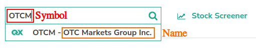
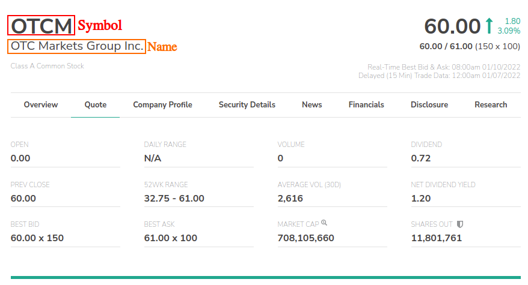

# **Challenge OTC - Majorkey - By Federico Pflüger**

In this challenge I will carry out the exercises proposed in the file "QA Automation.docx"

# installation, configuration and execution
Go to the root directory of the project
Run the `npm install` command to install the corresponding dependencies
Run the `node ./node_modules/cypress/bin/cypress open` or `npx cypress open` command to open cypress

# Refinement items

## Selector to use: 
	In this case I use the XPath selectors to simplify access to DOM elements
    
## Point 5: Capture – Open/Market Cap
	The 2 requested values ​​were captured, but with the first value, no action or validation was indicated to be performed
    
## Point 7: Assert the Company Name and Symbol
    

        
I Consider that the name was obtained from the option selected when searching in point 2 and the symbol corresponds to the name with which the search was made
	

I Consider the following fields as a Name and Symbol:
	
